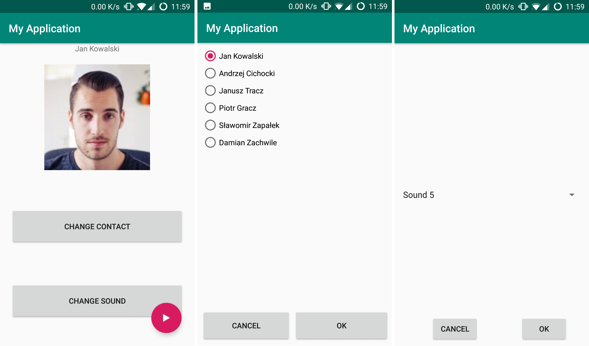

# AndroidDemo1
Prosta aplikacja mobilna prezentująca podstawowe możliwości środowiska Android Studio. 
Projekt zrealizowano na potrzeby laboratoriów *Programowania terminali mobilnych (Politechnika Poznańska)*.

